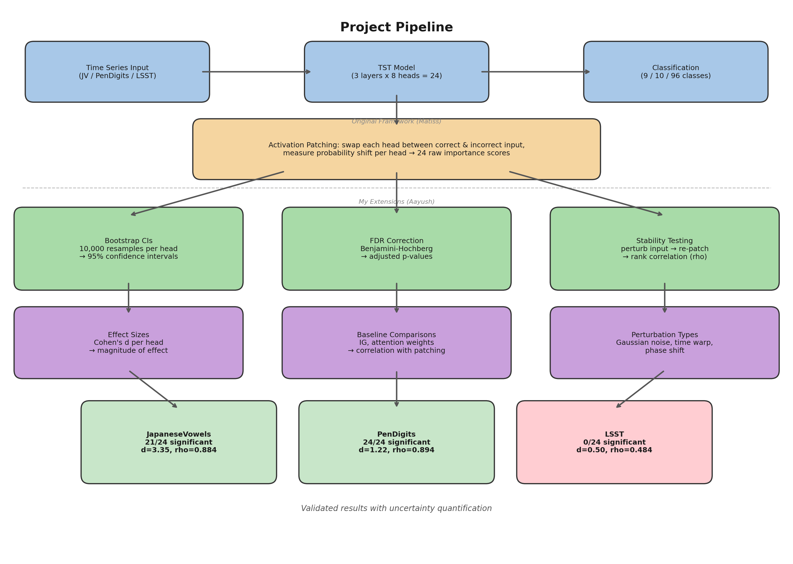
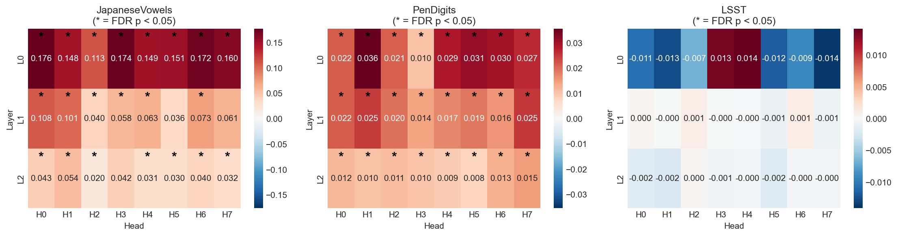
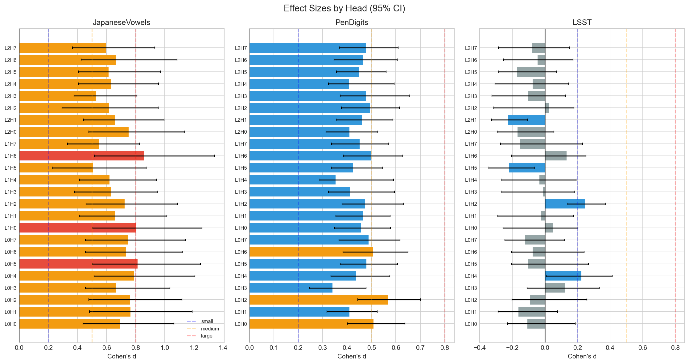
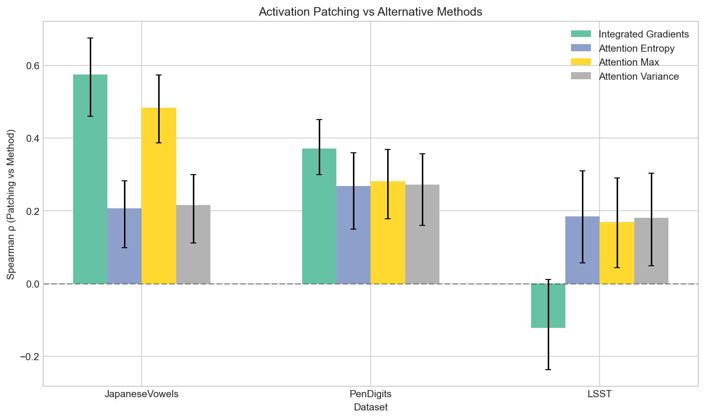
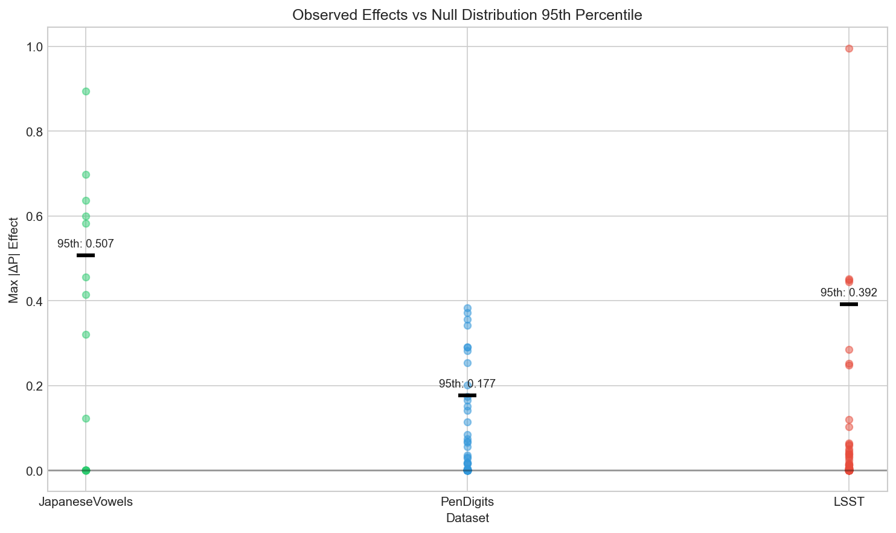

# Statistical Validation of Activation Patching in Time Series Transformers

### Are the "Important" Heads Actually Important?

**Aayush Baniya** | [BlueDot Impact AI Safety Fundamentals](https://www.bluedot.org/)

---

## Summary

Activation patching on a Time Series Transformer identified 8 out of 24 attention heads as causally important on a 96-class dataset. After FDR correction, zero survived. Every one was a false positive. The heatmaps looked clean the whole time.

On simpler tasks (9-10 classes), the method works - 21-24 heads survive statistical correction with large effect sizes and stable rankings under perturbation. On complex tasks, it collapses. Without statistical validation, you can't tell the difference.

---

## Pipeline



A Time Series Transformer (3 layers, 8 heads per layer, 24 total) is trained on a classification task. Activation patching swaps each head's output between a correctly and incorrectly classified input, producing 24 raw importance scores.

Those scores then go through:
- **Bootstrap resampling** (10,000 iterations) for 95% confidence intervals
- **FDR correction** (Benjamini-Hochberg) to control for 24 simultaneous tests
- **Stability testing** - perturb inputs with noise, re-run patching, check if rankings hold
- **Baseline comparisons** against Integrated Gradients and attention weights
- **Effect sizes** (Cohen's d) for magnitude

~3,840 lines of statistical code, 174 automated tests.

---

## Results

### Head Importance



Left to right: JapaneseVowels, PenDigits, LSST. Stars mark heads that survived FDR correction. JapaneseVowels has deep reds and 21 stars. LSST is near-zero everywhere with no stars.

| Dataset | Classes | Significant Heads | Cohen's d | Stability (rho) |
|---------|---------|-------------------|-----------|------------------|
| JapaneseVowels | 9 | 21/24 | 3.35 | 0.884 |
| PenDigits | 10 | 24/24 | 1.22 | 0.894 |
| LSST | 96 | 0/24 | 0.50 | 0.484 |

### Effect Sizes



Per-head Cohen's d across all three datasets. JapaneseVowels and PenDigits sit in the medium-to-large range. LSST clusters around zero - most confidence intervals cross the zero line.

### Stability


How consistent are head rankings when you add noise to the input? JapaneseVowels and PenDigits stay above the 0.7 stability threshold. LSST is at 0.48 - the rankings reshuffle every time.

Tested with three perturbation types (Gaussian noise, time warp, phase shift) at multiple strengths. Bar heights are averages across all perturbations.

### Attention Weights vs Causal Importance



Correlation between attention metrics and patching effects: rho around 0.2 across all datasets. Integrated Gradients does better on simple tasks (rho = 0.575) but goes negative on LSST. Cheaper attribution methods don't track causal importance.

### Observed Effects vs Null



Each dot is one sample pair's maximum patching effect. Black bar is the 95th percentile of the null distribution. JapaneseVowels sits well above. LSST clusters right around the null - indistinguishable from chance.

---

## Why LSST Fails

With 96 output classes, probability mass per class is ~1%. Single-head patching produces shifts of 0.1-0.5% - below the noise floor. The method lacks statistical power once the output space dilutes per-head effects below detectability.

This is a complexity-dependent ceiling on head-level causal attribution.

---

## Reproducing

```bash
git clone https://github.com/AayushBaniya2006/TST-Mechanistic-Interpretability.git
cd TST-Mechanistic-Interpretability
pip install -e ".[dev]"

python Scripts/run_complete_analysis.py        # Full statistical pipeline
python Scripts/run_stability_experiments.py    # Stability testing
pytest tests/ -v                               # 174 tests
```

Seed 42, 10,000 bootstrap resamples, FDR alpha = 0.05.

---

## Repo Structure

```
Utilities/
├── statistics.py          Bootstrap CIs, FDR correction, effect sizes
├── baselines.py           Integrated Gradients, attention weight analysis
├── stability_metrics.py   Rank correlation, top-K overlap
├── metrics.py             Logit diff, KL divergence, cross-entropy
├── perturbations.py       Gaussian noise, time warp, phase shift
├── config.py              Seed management, experiment configs
├── utils.py               Activation patching, sweeps, visualization
└── TST_trainer.py         Model architecture, training

Results/Summary/
├── figures/               fig1-fig5 + pipeline diagram
├── tables/                Statistical tables
└── data/                  CIs, p-values, effect sizes, stability scores

tests/                     174 automated tests
Scripts/                   Pipeline automation
Notebooks/                 Interactive exploration
TST_models/                Pre-trained weights
```

---

## Open Questions

- Where between 10 and 96 classes the ceiling is
- Whether group-level patching recovers signal on complex tasks
- Whether head importance rankings change across training seeds
- How this extends to other Transformer architectures

---

## Citation

```bibtex
@misc{tst-mechanistic-interp,
  author = {Baniya, Aayush and Kalnare, Matiss},
  title = {Statistical Validation of Activation Patching in Time Series Transformers},
  year = {2025},
  url = {https://github.com/AayushBaniya2006/TST-Mechanistic-Interpretability}
}
```

---

Done through [BlueDot Impact AI Safety Fundamentals](https://www.bluedot.org/).

The activation patching framework this builds on was created by Matiss Kalnare: [github.com/mathiisk/TST-Mechanistic-Interpretability](https://github.com/mathiisk/TST-Mechanistic-Interpretability)
